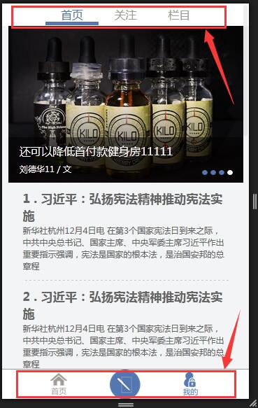
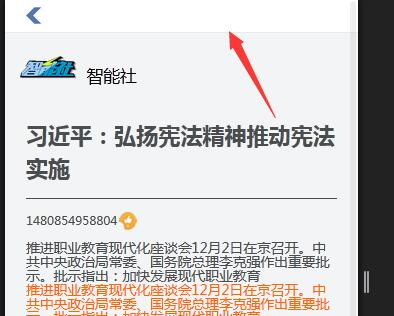

# 【vue】vuex learning summary~c~

### 1.官方的为什么

* 当我们的应用遇到多个组件共享状态时，单向数据流的简洁性很容易被破坏：
* 多个视图依赖于同一状态。
* 来自不同视图的行为需要变更同一状态。

* 对于问题一，传参的方法对于多层嵌套的组件将会非常繁琐，并且对于兄弟组件间的状态传递无能为力。对于问题二，我们经常会采用父子组件直接引用或者通过事件来变更和同步状态的多份拷贝。以上的这些模式非常脆弱，通常会导致无法维护的代码。
* 因此，我们为什么不把组件的共享状态抽取出来，以一个全局单例模式管理呢？在这种模式下，我们的组件树构成了一个巨大的“视图”，不管在树的哪个位置，任何组件都能获取状态或者触发行为！
* 另外，通过定义和隔离状态管理中的各种概念并强制遵守一定的规则，我们的代码将会变得更结构化且易维护。
* 这就是 Vuex 背后的基本思想，借鉴了 Flux、Redux、和 The Elm Architecture。与其他模式不同的是，Vuex 是专门为 Vue.js 设计的状态管理库，以利用 Vue.js 的细粒度数据响应机制来进行高效的状态更新。
* 个人理解就是把所有组件的所有事件和属性统一管理，最重要的解决：多个组件依赖同样属性，然后通过改变通用属性的情况。

### 2.基础写法

```
【1.下载】
npm install vuex -D

【2.全局导出一个文件store.js给main.js，绑定到根组件上】
import Vue from 'vue'
import App from './App.vue'

【3.这个store是引用过来的，挂载到了根组件下面】
import store from './store'

new Vue({
    store,
    el: '#app',
    render: h => h(App)
})

```

```
【3.store.js】
import Vue from 'vue'
import Vuex from 'vuex'

Vue.use(Vuex);

【全局变量，初始化数据】
var state = {
    count: 10
};

【真正的业务逻辑都在这里，执行的业务逻辑全部放在这里。处理状态(数据)变化】
const mutations = {
    // 这个行为就是让全局变量的 state.count--代表的count这个组件注册过来的属性进行变化
    // 所以 vuex的意思是让所有组建的数据进行互通么？
    increment(state) { 
        state.count++;
    },
    decrement(state) {
        state.count--;
    }
};

【注册过来的事件（名字和注册过来的及在组件中的注册的事件名称）】
//处理你要干什么，异步请求，判断，流程控制
const actions = {
    increment: ({ 
        commit
    }) => {
        【去执行--increment--这个行为】
        commit('increment')
    },
    decrement: ({
        commit
    }) => {
        commit('decrement');
    },
    clickOdd: ({
        commit,
        【注册的这个state也可以拿过来】
        state
    }) => {
        【根据注册的state拿到里面的属性进行条件处理】
        if (state.count % 2 == 0) {
            commit('increment')
        }
    },
    clickAsync: ({
        commit
    }) => {
        【ES6语法 promise】
        new Promise((resolve) => {
            setTimeout(function() {
                commit('increment');
                resolve();
            }, 1000);
        });
    }
};

【接受组件中注册过来的属性值】
const getters = {
    【count】
    count(state) {
        return state.count;
    },
    getOdd(state) {
        return state.count % 2 == 0 ? '偶数' : '奇数';
    }
};

【需要导出Store对象，然后注册到根组件上】
export default new Vuex.Store({
    state,
    mutations,
    actions,
    getters
});
```

```
【APP.vue】
<template>
  <div id="app">
    <h3>welcome vuex-demo</h3>
    <input type="button" value="增加" @click="increment">
    <input type="button" value="减少" @click="decrement">
    <input type="button" value="偶数才能点击+" @click="clickOdd">
    <input type="button" value="点击异步" @click="clickAsync">

    <div>
      现在数字为: {{count}}, 它现在是 {{getOdd}}
    </div>
  </div>
</template>

<script>
【从vuex接受两个工具用于组件的事件和属性的注册】
  import {mapGetters, mapActions} from 'vuex'

  export default{
    computed:mapGetters([
      'count',
      'getOdd'
    ]),
    methods:mapActions([
      'increment',
      'decrement',
      'clickOdd',
      'clickAsync'
    ])
  }
</script>
```

### 3.官方推荐

```
【官方推荐】以下注释为个人理解
store/
--actions.js【接受注册的事件】
--getters.js【接受注册的变量】
--index.js【负责导出这个模块】
--mutations.js【全部的业务逻辑都在这里】
--types.js【指令的名称系统】

【-----------------------main.js】引入注册
import Vue from 'vue'
import App from './App.vue'


import store from './store/'
【挂载在根组件下面】
new Vue({
    store,
    el: '#app',
    render: h => h(App)
})

【-----------------------index.js】
import Vue from 'vue'
import Vuex from 'vuex'

Vue.use(Vuex);

import mutations from './mutations'
import actions from './actions'

export default new Vuex.Store({
    modules:{
        mutations
    },
    actions
});


【-----------------------types.js--新增一个方法，先新增一条指令】
export const INCREMENT = 'INCREMENT';
export const DECREMENT = 'DECREMENT'; 

【-----------------------actions.js--接受传递过来的事件，相应的发出指令】

import * as types from './types' 【es6所有的指令】
export default {
    increment: ({
        commit
    }) => {
        commit(types.INCREMENT);
    },
    decrement: ({
        commit
    }) => {
        commit(types.DECREMENT);
    },
    clickOdd: ({
        commit,
        state
    }) => {
        【注意这里是state.mutations.count】
        if (state.mutations.count % 2 == 0) {
            commit(types.INCREMENT);
        }
    },
    clickAsync: ({
        commit
    }) => {
        new Promise((resolve) => {
            setTimeout(function() {
                commit(types.INCREMENT);
            }, 1000);
        })
    }
}

【----------------------getter.js--接受过来的属性，返回相应定义的全局的对象，】
export default {
    count: (state) => {
        return state.count;
    },
    getOdd: (state) => {
        return state.count % 2 == 0 ? '偶数' : '奇数'
    }
}


【-----------------------mutations.js--业务逻辑】

【引入指令】
import {
    INCREMENT,
    DECREMENT
} from './types'

【引入接受的数据】
import getters from './getters'

【定义的全局的对象】
const state = {
    count: 20
};

const mutations = {
    【es6:变量是是[]，正真的行为】
    [INCREMENT](state) {
        state.count++;
    },
    [DECREMENT](state) {
        state.count--;
    }
};


export default {
    state,
    mutations,
    getters
}
```

### 4.demo

* 1.首先要把图切好，分析好结构需要的组件结构



* 2.分析初始化组件或者根组件包括三个部分，nav_header,view,nav_footer。

```
// -------------------------------------------DIY VM
【引入全局组件】
import Loading from './components/loading'
Vue.use(Loading);
// ------------------------------------------style
require('./css/base.css'); 【引入全局的base文件】
```

* 3.nav_header，nav_footer里面该写路由写路由。注意组件的样式active-class和class

```
<router-link to="/column" tag="li" active-class="active">
    <a href="javascript:;">栏目</a>
</router-link>
```

* 4.配置路由。

```
【-------main.js】
// ------------------------------------------router
import VueRouter from 'vue-router'
Vue.use(VueRouter);
import routes from './router.config.js'

const router=new VueRouter({
    【切换路径模式，变成history模式】
    mode: 'history', 
    【滚动条滚动的行为，不加这个默认就会记忆原来滚动条的位置】
    scrollBehavior: () => ({ y: 0 }), 
    【这个属性必须叫--routes】
    routes
});

【-------router.config.js】
import Home from './components/Home.vue'
import userInfo from './components/user_info.vue'
export default [
  // 
  {
    path: '/home',
    component: Home
  },
  // 
  {
    path: '/follow',
    component: Home
  }, {
    path: '/column',
    component: Home
  },
  // 
  {
    path: '/user-info',
    component: userInfo
  },
  // ----------------
  {
    path: '*',
    redirect: '/home'
  }
]
```

* 5.切换用户信息路由时，nav_header的组件还会显示。按照自己的理解，主页路由是一个路由，里面有还有自己的路由和显示区。这个demo就在APP.vue上的模板上设置了一个显示区。默认是转跳主页，切换到用户路由时，nav_header要影藏。这里使用vuex

```
【-----------------App.vue】
import {mapGetters} from 'vuex'

export default {
  name: 'app',
  computed: mapGetters([
    'head_view_state',
    'loading_view_state'
    ]),
  data() {
    return {}
  },
  methods: {},
  watch:{
    【监听$route的变化，为什么会有$route，应该是main.js挂载到router】
    $route(to){
      if(to.path=='/user-info'){
        【!!挂载到根组件后,app.vue这个组件上有--this.$store--这个属性】
        this.$store.dispatch('headHide');
      }
      // 其他页面
      else {
        this.$store.dispatch('head_show');
      }
    }
  },
  components: {
    headerNav,
    footerNav
  },
  mounted() {},
}


【----main.js】
new Vue({
  el: '#app',
  // 挂载全局store
  store,
  // 开启路由
  router,
  // 绑定根组件
  render: h => h(App)
})
```

* 6.接下就是vuex的配置。

```
【---getters.js】
export default {
    head_view_state(state){
        return state.head_view_state
    },
    loading_view_state(state){
        return state.loading_view_state
    }
}

【---mutations.js】
import getters from './getters.js'

const state = {
  head_view_state: true,
  loading_view_state:false
}

const mutations = {
    // ES6 直接写函数
    headHide(state){
        state.head_view_state = false;
    },
    head_show(state){
        state.head_view_state = true;
    },
    loading_show(state){
        state.loading_view_state = true;
    },
    loading_hide(){
        state.loading_view_state = false;
    }
};

export default {
  state,
  getters,
  mutations
}

【---index.js】
import Vue from 'vue'
import Vuex from 'vuex'
import actions from './actions.js'
import mutations from './mutations.js'

Vue.use(Vuex);

// new Vuex.Store--为大写
export default new Vuex.Store({
  modules: {
    mutations
  },
  actions
})

【---actions.js】
export default {
  【ES6 --箭头函数】【这里state需要的属性都是挂载在mutations下的，和getters,mutations不冲突】
  headHide: ({ commit, state }) => {
    commit('headHide')
  },
  【ES6 --直接写函数】
  head_show({ commit }) {
    commit('head_show')
  },
  loading_show({ commit }){
    commit('loading_show')
  },
  loading_hide({ commit }){
    commit('loading_hide')
  },
}
```

* 7.axios交互

```
【---main.js】
// ------------------------------------------axios
import axiosFn from './axios.config.js'
axiosFn(store,Vue);

【---axios.config.js】
import axios from 'axios'

export default function(store,Vue) {
  //axios的一些配置，比如发送请求显示loading，请求回来loading消失之类的

  【配置发送请求前的状态】
  axios.interceptors.request.use(function(config) { 
    // 引入过来的对象上面有dispatch方法
    store.dispatch('loading_show')
    return config;
  }, function(error) {
    return Promise.reject(error);
  });

  【配置请求回来的状态】
  axios.interceptors.response.use(function(response) { 
    store.dispatch('loading_hide')
    return response;
  }, function(error) {
    return Promise.reject(error);
  });
    
  
  /*axios.defaults.baseURL = (process.env.NODE_ENV !=='production' ? config.dev.httpUrl:config.build.httpUrl);
  【配置post请求的头部设置】
  axios.defaults.headers.post['Content-Type'] = 'application/x-www-form-urlencoded';*/
  【配置API默认访问的地址】
  //axios.defaults.baseURL='http://localhost:8082/';
  
  【其他页面在使用axios的时候直接  this.$http就可以了，这个配置很牛逼啊】
  Vue.prototype.$http = axios 
}

---------------------------------------------------------------------------
【到现在使用vuex出现的store有两个地方了】
【1.组件内部】
watch:{
    $route(to){
        if(to.path=='/user-info'){
        【挂载到根组件后,app.vue这个组件上有--$store--这个方法】
        this.$store.dispatch('headHide');
        }
        // 其他页面
        else {
        this.$store.dispatch('head_show');
        }
    }
},
【2.非组件内部使用】
axios.interceptors.request.use(function(config) { 
    // 引入过来的对象上面有dispatch方法
    store.dispatch('loading_show')
    return config;
}, function(error) {
    return Promise.reject(error);
});
【综上：】在main.js上引入的store是挂载到根组件app.vue上的。所有该组件可以使用this.$store的方法，还有就是直接引入过来的store上面就有发出dispatch的方法。
// ------------------------------------------vuex--store
import store from './store/index.js'
// ------------------------------------------init-app
new Vue({
  el: '#app',
  // 挂载全局store
  store,
  // 开启路由
  router,
  // 绑定根组件
  render: h => h(App)
})
---------------------------------------------------------------------------
【app.vue--保证页面有数据不销毁】
<keep-alive>
  <router-view></router-view>
</keep-alive>
```

* 8.点击其中一个条目进行转跳

```
【-----home.vue】
<li v-for="(item,index) in arrList">
  【属性绑定 :to="'/article/'+item.id" 才可以拼接】
  <router-link :to="'/article/'+item.id">
    <h2>{{index+1}} . {{item.title}}</h2>
    <p>{{item.detail}}</p>
  </router-link>
</li>

【----路由设置】
{
  path: '/article/:id',
  component: homeArticle
},

【----home_article.vue】
export default {
  name: 'homeArticle',
  mounted() {
    【2.相应的测试this.$store也可以拿到】
    console.log(this.$store);
    【注意在本组件的this.$route.params可以拿到变化的路由】
    this.fetchData(this.$route.params.id);
  },
  data() {
    return {
      articleData: {}
    }
  },
  watch: {
    【1.这里竟然也可以拿到$route】
    $route(to) {
      【这里可以打印是，在app.vue router-view包在keep-alive下，因为组件没有销毁，所以可以监听】
      console.log(to);
    }
  },
  methods: {
    fetchData(id) {
      var me = this;
      this.$http.get('/data/article.data')
      .then(function(res) {
        me.articleData = res.data[id];
      })
      .catch(function(err) {
      })
    }
  }
}
【返回出条目---window.history.go(-1)】
 <li class="l-btn" onclick="window.history.go(-1)"></li>


------------------------------------------------------------------------
【根组件初始化，在组件内部挂载store，router，就在全局的组件都可以拿到这两个属性--this.$store--this.$route，这些应该是设置的】
// -----init-app
new Vue({
  el: '#app',
  // 挂载全局store
  store,
  // 开启路由
  router,
  // 绑定根组件
  render: h => h(App)
})

【自定义设置所有组件会有的对象】
Vue.prototype.obj = {
  a:1,
  b:2
}
```

* 【样式的问题，把顶部导航覆盖了，按道理应该在store设置】




* 9.过滤器

```
import filters from './filters'
Object.keys(filters).forEach(key => Vue.filter(key, filters[key]))
```

* 10.路由懒加载:当打包构建应用时，Javascript 包会变得非常大，影响页面加载。如果我们能把不同路由对应的组件分割成不同的代码块，然后当路由被访问的时候才加载对应组件，这样就更加高效了。

```
const Foo = resolve => require(['./Foo.vue'], resolve)
```
