# 全栈 开发权限分配，用户管理，课程选择~c~

### 1.下载运行：

* `git clone  地址`
* `npm install` 
* 开启数据库（mongod --storageEngine mmapv1 --dbpath C:\dev\mongoDB_data\cc_datas）
* node app 
* 访问3000端口

### 2.项目开始：

#### 2.1项目说明：

* 前端到后台再到数据库的全栈项目，全部是JS的知识。属于JS全栈开发的一个集中案例。初学者可以按照这个进行学习和二次开发。
* 前端：bootstrap搭皮肤，面向对象写业务逻辑。弹层用layerUI。登录的背景用[particles.js](https://marcbruederlin.github.io/particles.js/#documentation),具体学习参见官网。个人感觉粒子背景还不错。前端目录：

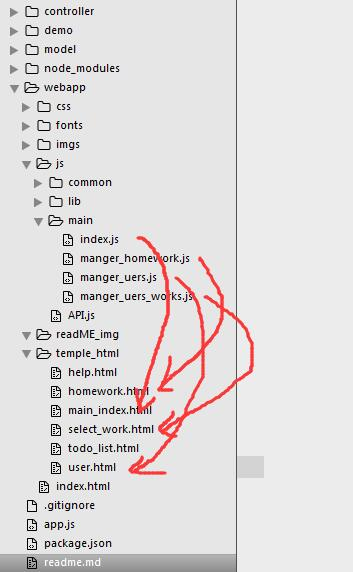

* 后台：express搭的后台。app.js负责路由的分发，controller里文件为所有的路由的业务。model文件夹是所有数据库表的类。

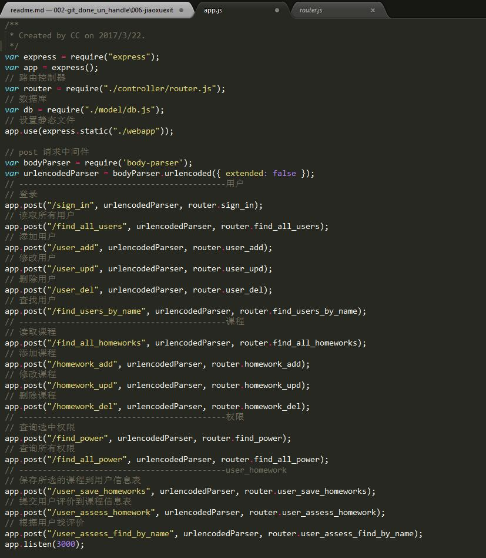

* 数据库：用mongoose搭建我们需要的各种类;mongoose为面向对象的形式操作数据库，极大的减少了我们开发的难度。

#### 2.2项目目录：

* 因为现在前后分家，前端只是负责渲染数据，后台只是发数据。所以用下面的目录结构，不是MVC，类似MVC。其实这样的目录结构也能看到我们的学习过程，webapp里面的结构就是平时写前端的目录，所有的页面和引用都是在一个目录下进行引用，不会后台没有关系，写把前端的页面和引用都弄好就行了。这样的话就是前段用node开发后台时，也是给出接口就行。其他的页面渲染都在webapp中完成。作为后台的我们是不需要管的。node后台只需要把webapp文件夹设置成静态文件夹即可：

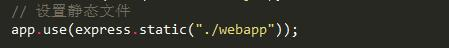

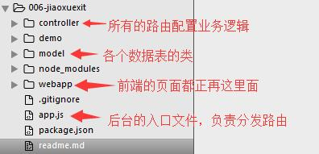

### 3.项目开发：

#### 3.1mongoose数据库构建：

* 用户管理：超级管理员可以管理：管理用户、对用户分配权限、增删改查。
* 用户登录自己的账号可以自己选择课程，进行课程学习，对课程评价。所以用户需要：名字。密码，选择课程的ID集合，所有权限的ID集合。（先可以生产一个超级管理员账户进行登录。）

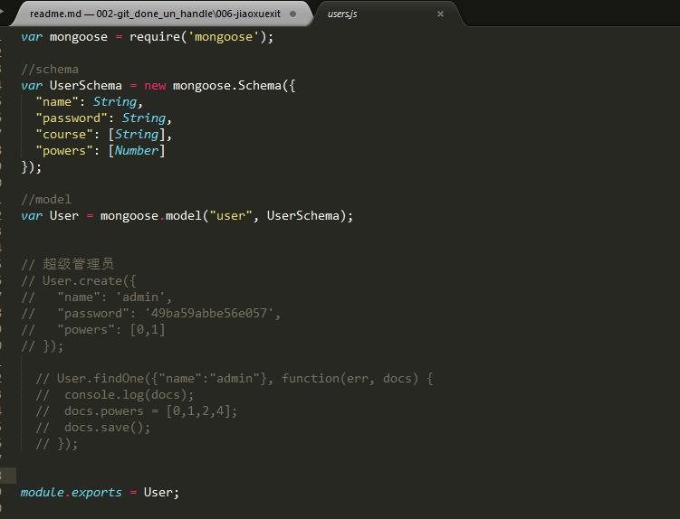

* 课程管理：超级管理员可以增删改查，用户登录可以选择课程，对课程进行评价。所以课程有：名字，描述，（按道理还有课程的视频地址，后期完善），用户的评价集合。

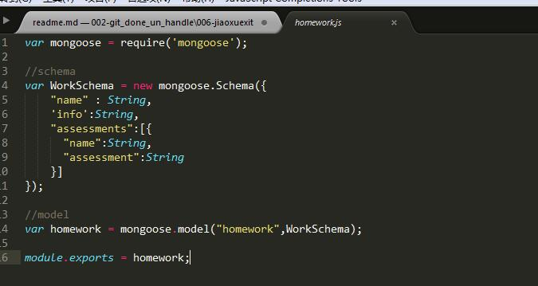

* 权限管理：权限管理还没有开放：只是后台形成权限的类，并同时生成数据和相应的页面地址：

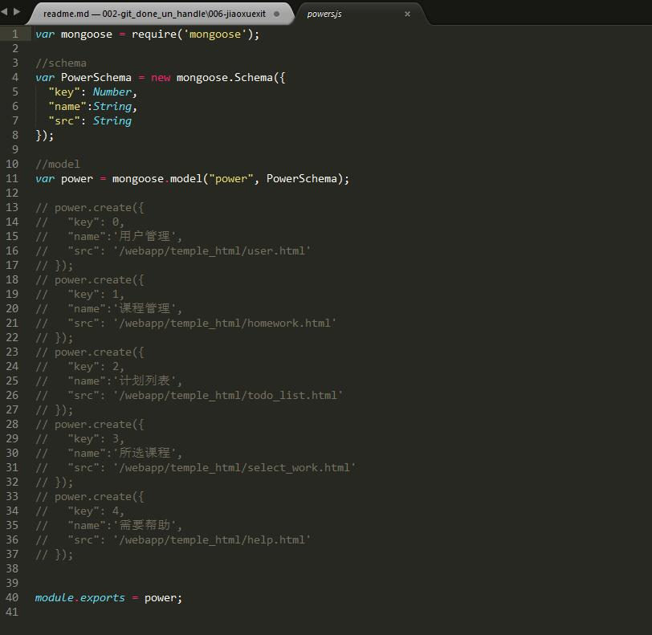

#### 3.2主页登录：

* 主页登录代码直接写在index.html中，登录成功后进行加载相应的页面。

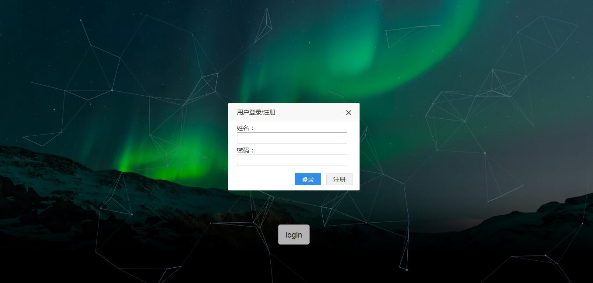

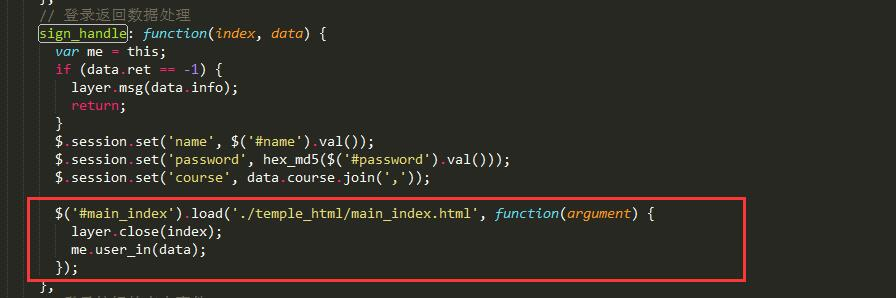

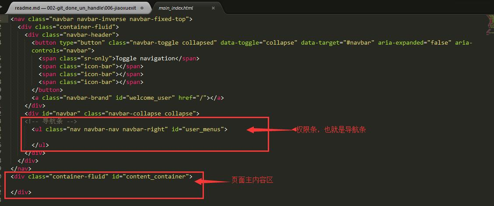

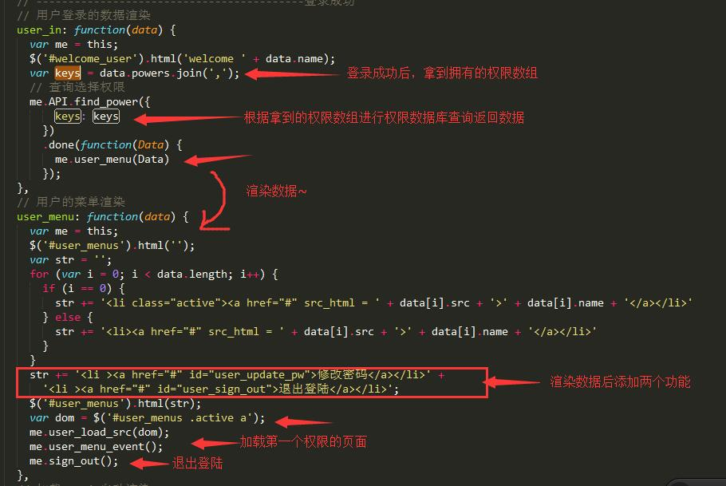

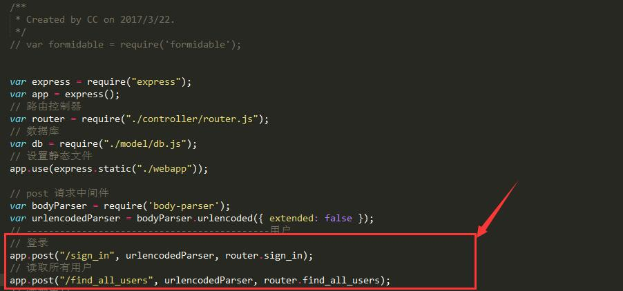

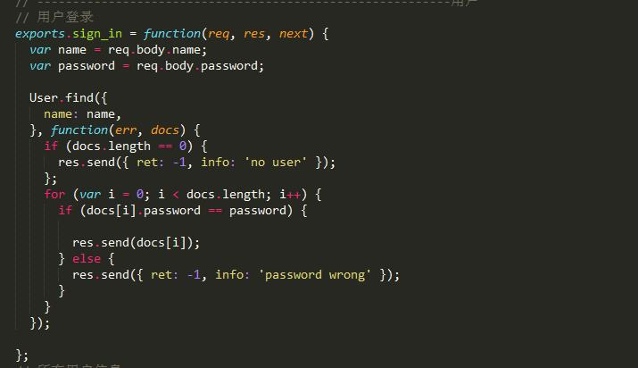

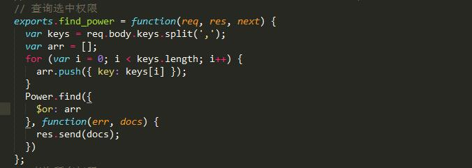

* 超级管理员（admin,123456）登录成功页面：建数据库的时候默认admin有全部权限。

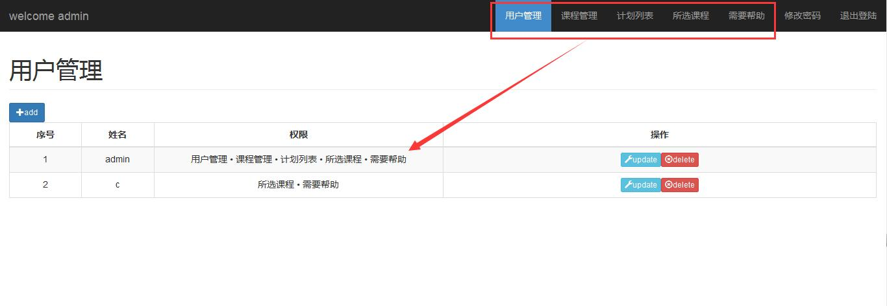

* 超级管理员新建的用户默认密码为000000（前端进行加密），可以分配权限，编辑进行权限反选，默认权限配置在全局文件中：

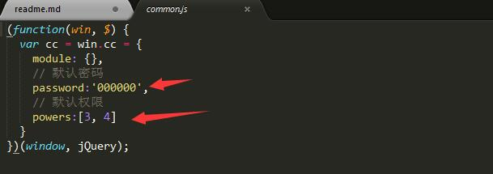

* 这里后台没有做通过用户ID找用户的信息，而且前端直接把表格中的数据拿回来，对于一开始拿到的权利的所有数据进行反选。

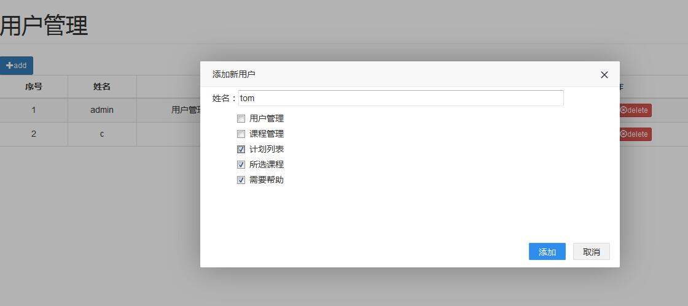

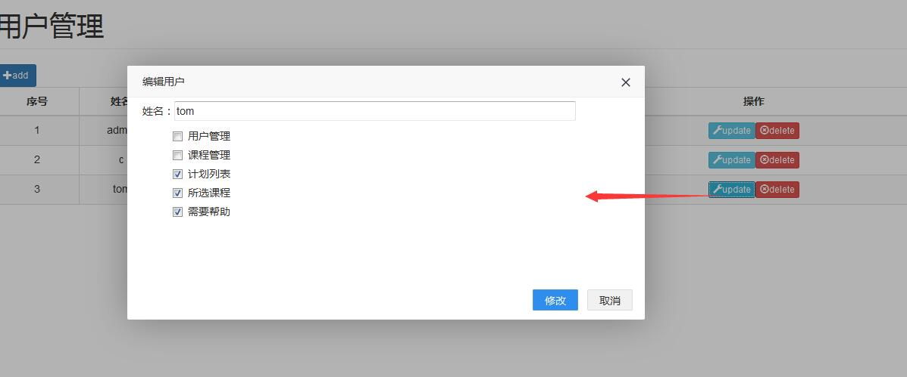

代码（前端）：

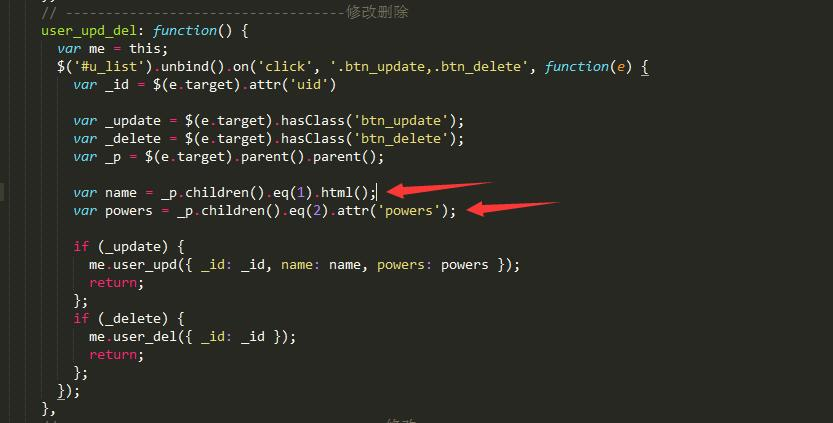

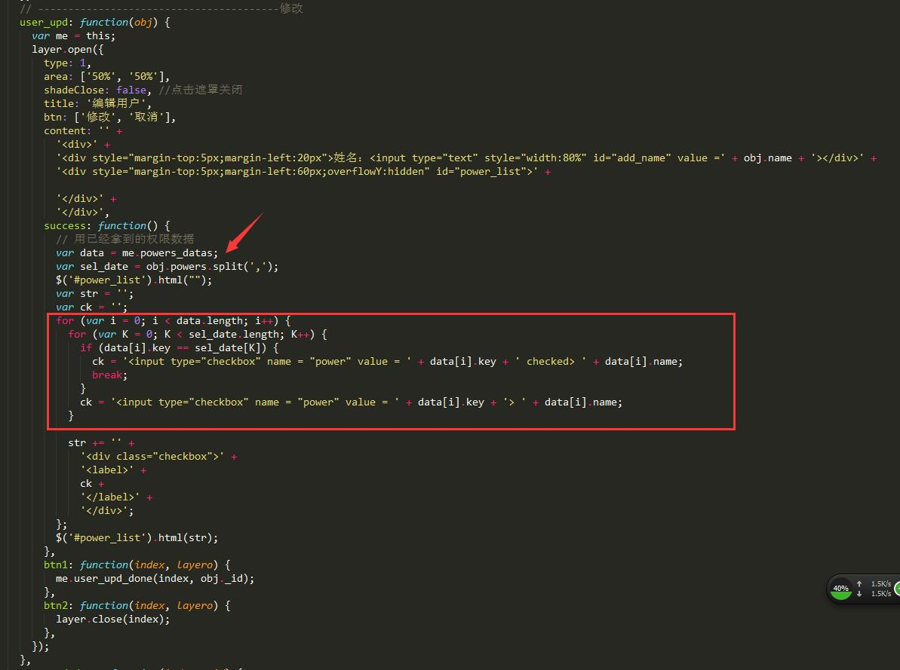

* admin创建的用户可以登录自己的账户。

#### 3.3普通账户：

* 登录账户，点击到【所选课程】进行课程选择，把选择好的课程ID绑定到当前登录用户信息中：

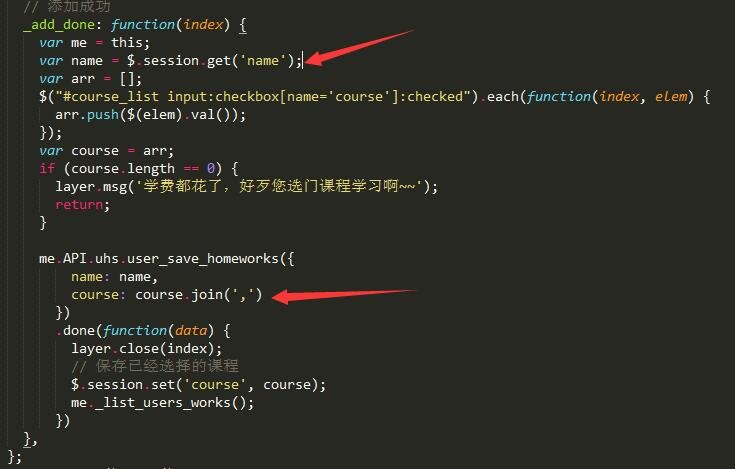

* 账户登录的特别说明：因为登录后会从后台拿登录账户的信息，这里前端做了常登陆的设置。把登录的用户名和密码还有所选课程进行了session设置。注意选择课程这个属性值为数组，保存时需要转换为string才可保证。同时保存所选课程ID也需要转化为string可往后台传数据：

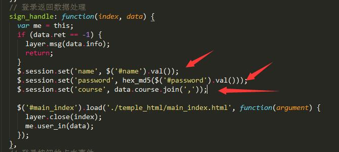

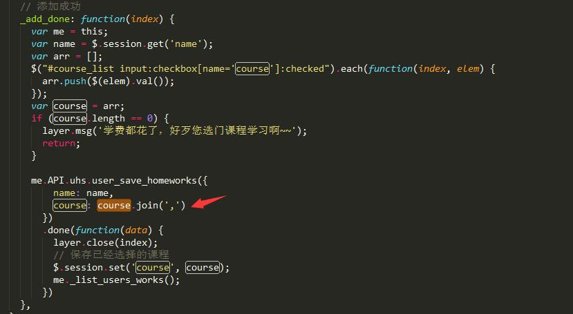

* 后台拿到数据转化为arr进行保存：

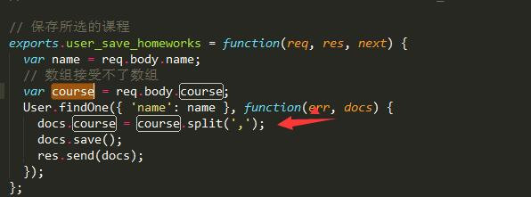

#### 3.4课程评价：

* 课程评价是课程信息中保存用户信息和用户评价，所以课程的模型为：（assessments字段中保存对象）

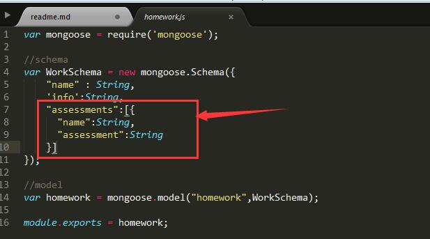

* 再次对该课程点击评论可以进行反查以前的评论，所以在点击评论时，先对后台发出一个查询API。把查询到的评论返回来：

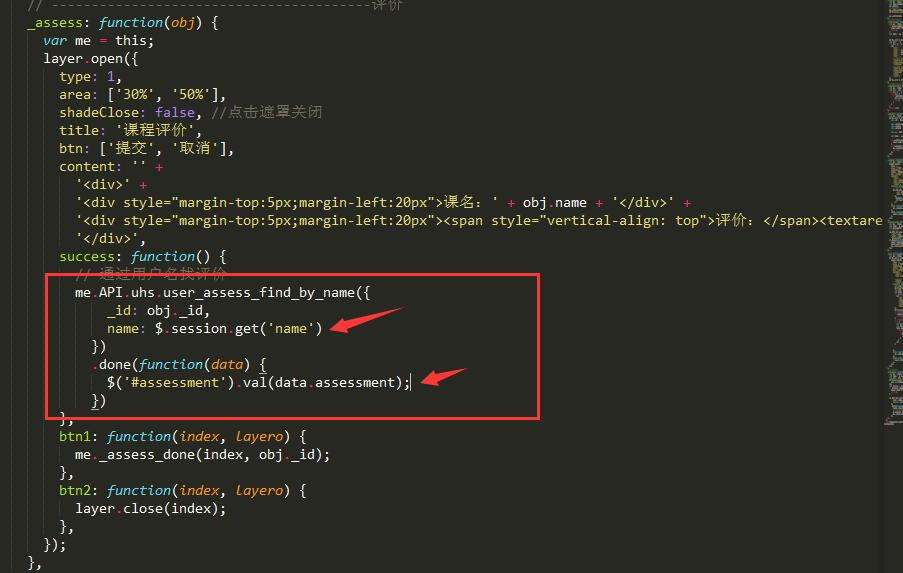

* 后台代码：

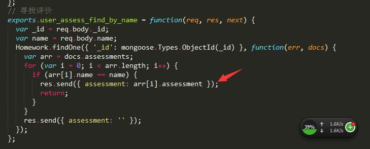

* 代码设计：每个用户都可以对同一门课程进行评价，但每一个用户的评价都是唯一的，这样就涉及到user的数据库设计用户名也是唯一设计的。这里还有一个小bug，就是课程评价的时候，保存的是当前用户的name和评价，应该保存用户的ID,保存用户姓名的话，超级管理员删除该用户的时候，需要把课程中所有有关该用户的评论删除掉，以防删除用户后，再次创建相同用户名时，点击课程评论时有以前用户的评价。

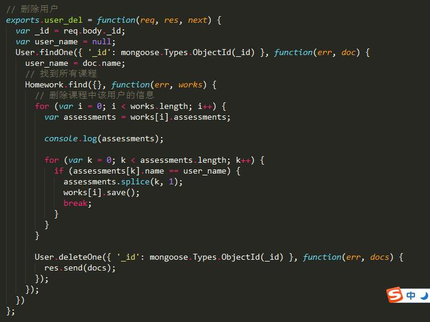

### 4.项目总结：

* 项目涉及到了最简单的权限分配，课程分配，课程评价，都是从最开始的数据库设计，到再结合前端自己的业务进行后台API的设计。大概流程就是先根据业务逻辑进行数据库设计，然后写后台，再写前端，都是一个业务一个业务的从数据库到前端的实现。
* 第一次实现了个从后到前的项目实现，任何需求不要脑子想，一定要动手敲一敲。
* 最后推荐大家个很不错的前端网站，上面有很多流行的东西可以加入到自己项目中：[【tutorialzine】](http://tutorialzine.com/)
* 前端这次设计没有用iframe，嵌套各自模块的页面。用的时JQ的load函数。感觉这个不是很好。后期这个一定要修改。
* 数据库可能报的错：

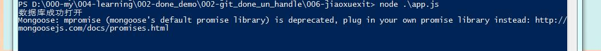

* 解决方式：

